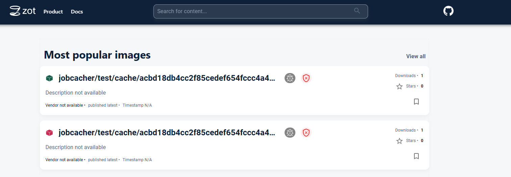
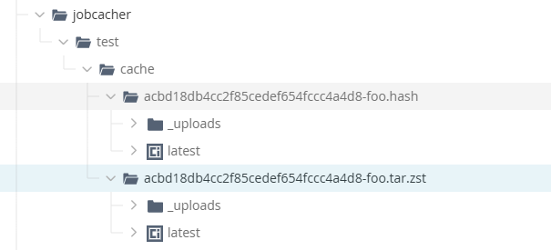
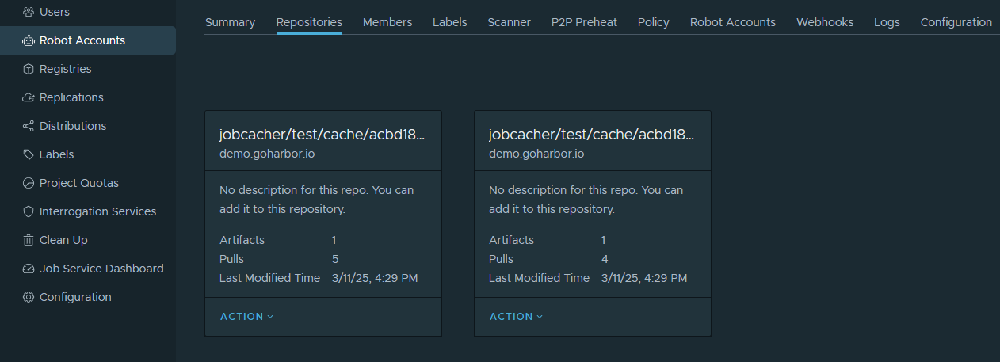
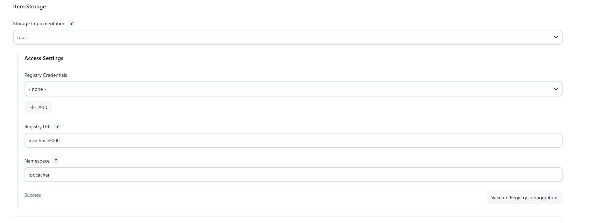

# Jobcacher ORAS Extension plugin

This plugin is an extension of the [jobcacher-plugin](https://plugins.jenkins.io/jobcacher/) that allows you to store the caches in OCI compliant registries like using ORAS

> [!WARNING]
> The ORAS Java SDK is currently in **alpha** state and might impact the stability of this plugin.
>
> It's configuration and APIs might change in future releases

<p align="left">
<a href="https://oras.land/"></a>
</p>

Currently, caches are stored "as-is", under a configurable `namespace` registry. This would require some update on `jobcacher` to support bundling OCI artifact with multiple layer or use referrer.

On ZOT



On Artifactory OCI



On Harbor



## Introduction

### Getting started

You only need to configure the extension to use ORAS under System Configuration.



See [jobcacher-plugin](https://plugins.jenkins.io/jobcacher/) for usage in jobs and pipelines.

For local testing you can use ZOT to start a registry

```shell
docker run -d -p 5000:5000 ghcr.io/project-zot/zot-linux-amd64:v2.1.2
```

> [!WARNING]
> Not using credentials is not recommended and will setup `insecure` registry mode and skip TLS verification
> 
> This should only be used when testing against a local registry


## CONTRIBUTING

See [CONTRIBUTING](CONTRIBUTING.md)

## LICENSE

Licensed under MIT, see [LICENSE](LICENSE.md)

